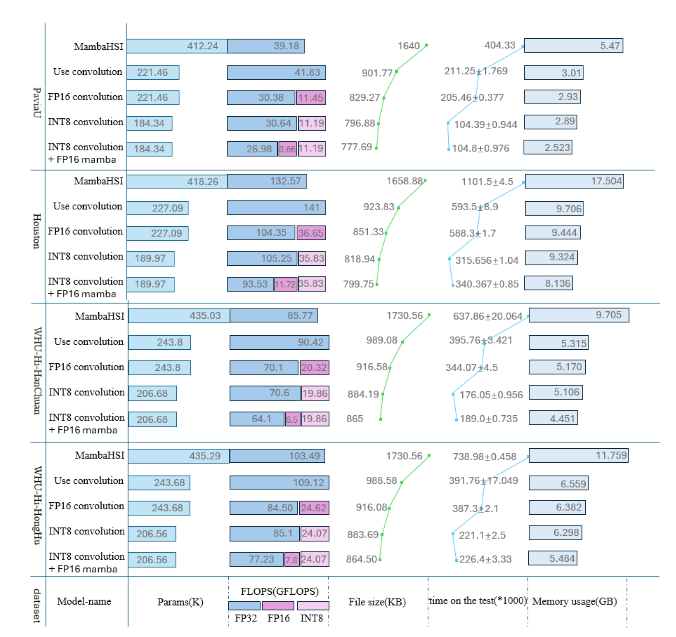

## **🚀 HiLoHSI: Efficient HSI Classification via High-Low Frequency Hybrid Quantization**  
### **📌 Introduction**  
HiLoHSI is a novel dual-path general framework for lightweight hyperspectral image (HSI) classification. It innovatively combines high-low frequency decoupling and hybrid quantization to reduce overhead while ensuring accuracy.

#### Framework Overview:

*Fig.1The overall architecture of HiLoHSI: a dual-path framework for efficient hyperspectral image classification*

#### MambaHSI Framework Embedding:

*Fig.2Architectural overview of MambaHSI with high-low frequency decomposition: comparison of the original model (top) and the frequency-decomposed variant (bottom), showing the integration of frequency decomposition modules within the three-block structure*

#### GSCVIT Framework Embedding:

*Fig.3Transformer model architecture modifications: Illustration of the original model (top) and its frequency-decomposed version (bottom), highlighting the replacement of the original module with a high-low frequency mixed quantization module*

### 📊 Experimental Results：
#### Mamba-Base:

#### Transformer-Base:

#### Other Quantitative Methods:

#### Ablation Experiment:

### ✨ Complexity

